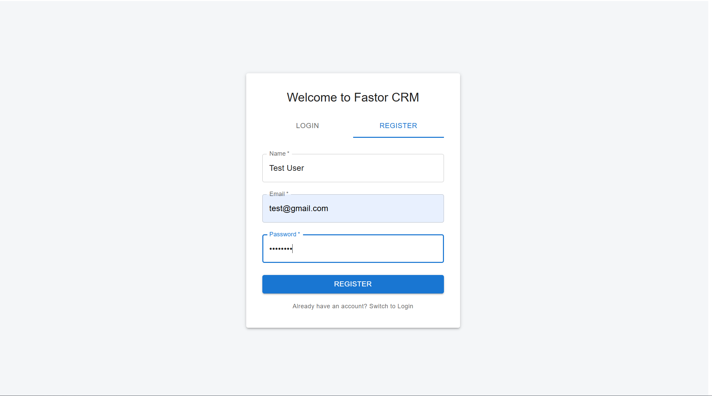
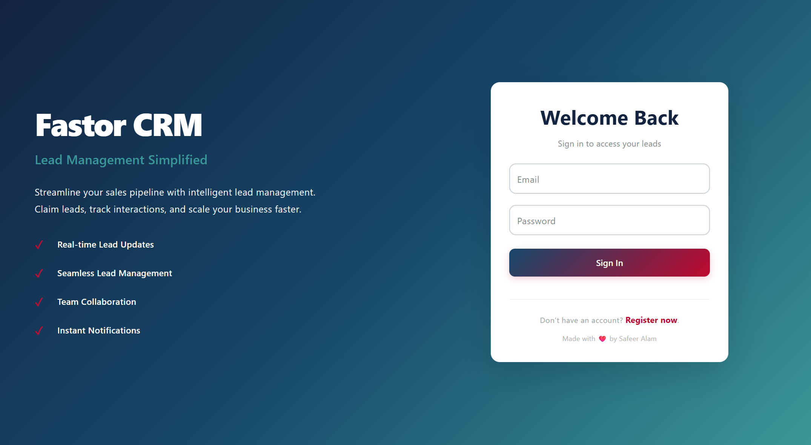
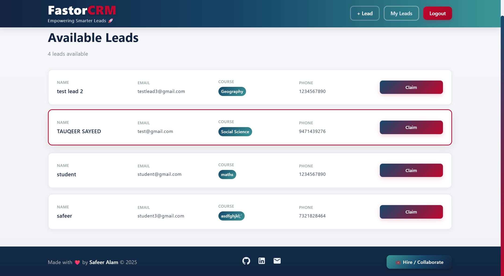
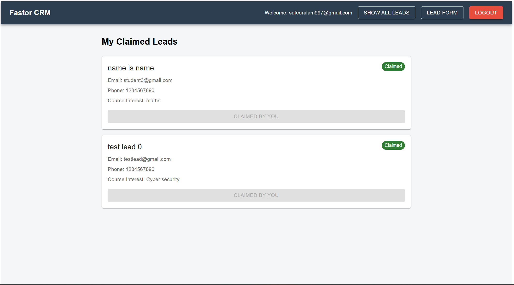
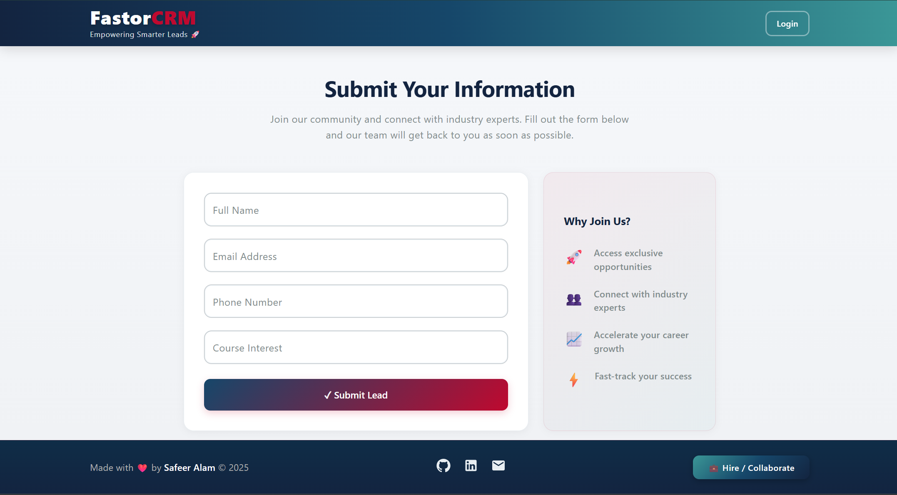

# 🧾 Fastor CRM 

Fastor CRM is a full-featured React application that allows users to register, authenticate, submit leads, view unclaimed leads, and claim leads for follow-up. The application features protected routes for authenticated users, public lead submission forms, and real-time notifications. It communicates seamlessly with the [Fastor CRM Backend](https://github.com/safeer997/fastorCrmBackend) API for all data operations.
<br>
Backend Repo Link : [Fastor CRM Backend](https://github.com/safeer997/fastorCrmBackend)

---
### 🌐 Live Links

- **Dashboard:** [https://fastorcrmfrontend.onrender.com/](https://fastorcrmfrontend.onrender.com/)
- **Submit Lead (Public):** [https://fastorcrmfrontend.onrender.com/submit-lead](https://fastorcrmfrontend.onrender.com/submitlead)

✨ Ready to use! No setup required — just visit the links and start managing leads!

---
## 📸 Screenshots

<div align="center" style="display: flex; flex-wrap: wrap; justify-content: center; gap: 20px; margin-bottom: 40px;">
  
  
</div>

<br><br>

<div align="center" style="display: flex; flex-wrap: wrap; justify-content: center; gap: 20px; margin-bottom: 40px;">
  
  
</div>

<br><br>

<div align="center" style="display: flex; flex-wrap: wrap; justify-content: center; gap: 20px; margin-bottom: 40px;">
  
</div>

---

## 🔐 Features

- **User Authentication:** Register and login with JWT tokens
- **Protected Routes:** Dashboard only accessible with valid token
- **Lead Management:** View unclaimed leads and claimed leads
- **Claim Leads:** Users can claim leads from unclaimed leads pool
- **Public Lead Form:** Anyone can submit leads without authentication
- **Real-time Updates:** Toast notifications for success and error messages
- **Responsive Design:** Works on desktop and mobile devices

---

## 🛠️ Tech Stack

- **Frontend:** React 19, Vite
- **UI Framework:** Material-UI (MUI)
- **Routing:** React Router DOM
- **HTTP Client:** Axios
- **Notifications:** React Toastify
- **Authentication:** JWT (localStorage)

---

## ⚙️ Installation Guide

1. **Clone the Repository**

   ```bash
   git clone https://github.com/your-username/fastorCrmFrontend.git
   cd fastorCrmFrontend
   npm install

   ```

2. **Change Api Urls **

   ```bash
   change to your localhost / backend service url
   ```

3. **Start the server**

   ```bash
   npm run dev
   ```

## 📫 Contact

- GitHub: [safeer997](https://github.com/safeer997)
- Email: safeeralam997@gmail.com

```
